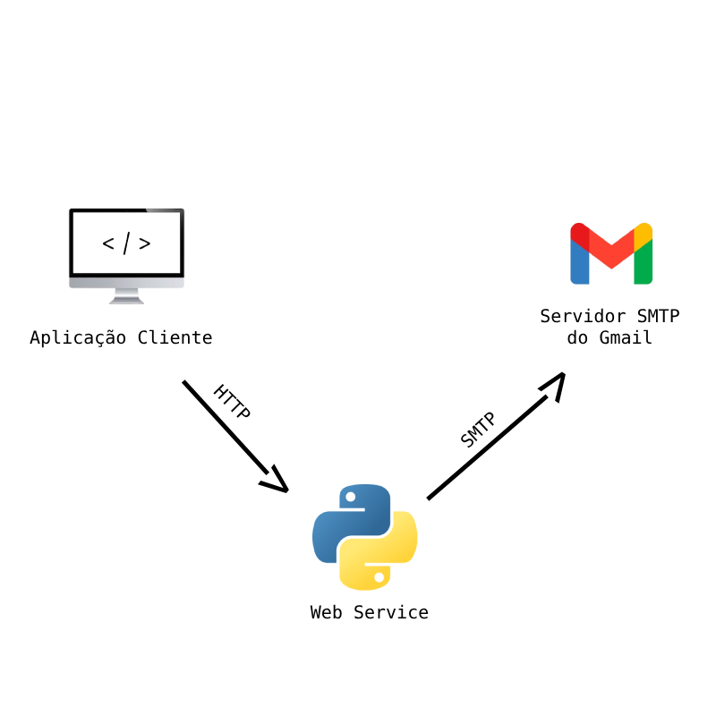
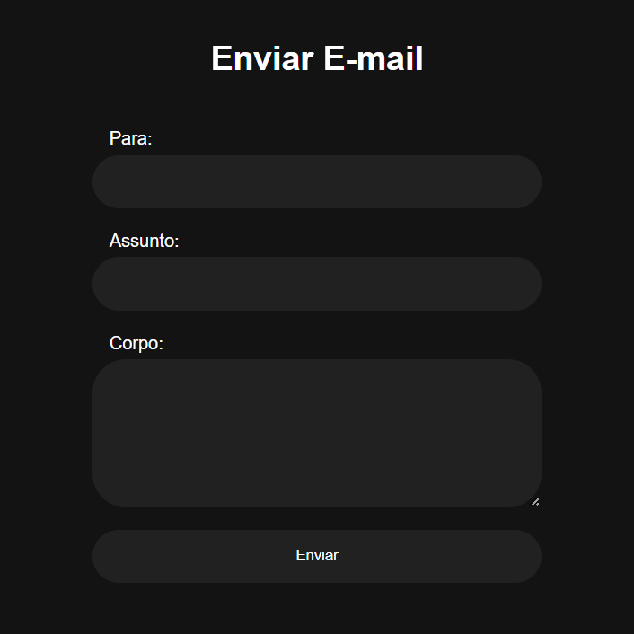
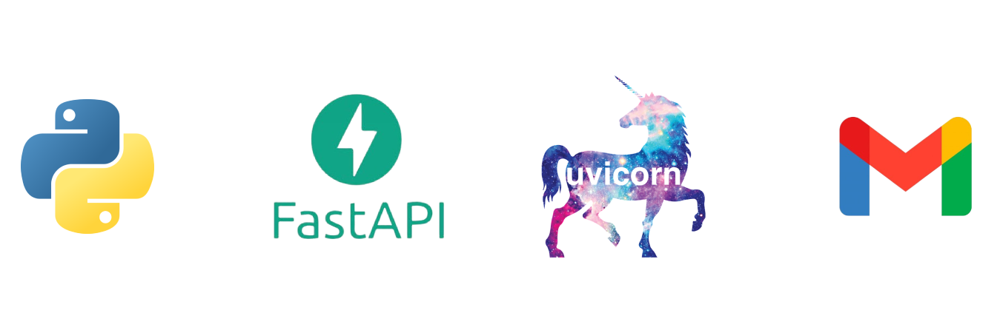

# TRABALHO DE REDES (SISTEMA DE ENVIO DE EMAILS)

## Alunos
- João Victor de Oliveira Costa
- Vítor Viana da Silva

## Professor
- Flávio

## Objetivo
Este projeto tem como finalidade o envio de e-mails através de um formulário HTML que faz uma requisição HTTP para uma aplicação web service responsável pelo envio de e-mails via SMTP. Este sistema foi dividido em dois módulos principais: o frontend, que é a aplicação cliente, e o backend, que é a aplicação servidor.

## Arquitetura do Projeto


## Aplicação Cliente
Esta camada do projeto é responsável por obter informações do usuário, como o e-mail de destino, o título do e-mail e a mensagem que será enviada, para o backend que está em localhost na porta 8000.



## Aplicação Servidor
A aplicação servidor foi construída utilizando a linguagem Python, o framework FastAPI e o servidor Uvicorn, que é um servidor para rodar aplicações assíncronas em Python. Nesta parte do projeto, também é utilizado o servidor SMTP do Gmail para que seja possível o envio dos e-mails pelo Web Server.



O FastAPI é responsável por receber as informações enviadas pelo cliente através do formulário, via HTTP, e pelo envio dos e-mails via SMTP. A arquitetura em camadas é a que está sendo utilizada para a organização do projeto. O projeto foi dividido em três camadas: configuração, controle e serviço.

- A camada de **configuração** contém as informações necessárias para estabelecer uma conexão com o servidor SMTP. 
- A camada de **controle** é responsável por disponibilizar a rota de comunicação entre o cliente e o servidor. O formulário enviado pelo cliente será enviado para a rota ```[POST] http://localhost:8000/api/email/send/```, e após o envio do formulário, a camada de controle irá se conectar com a camada de serviços.
- Por fim, a camada de **serviço** é responsável por obter as informações da camada de configuração, receber os dados do formulário passados pela camada de controle e estabelecer uma conexão com o servidor SMTP do Gmail para enviar o e-mail solicitado pelo usuário.

## Pré-Requisitos
É necessário possuir Python, FastAPI e Uvicorn.

## Instruções de Instalação
É necessário possuir o Python e o pip na máquina para gerenciar os pacotes do Python. O processo de instalação do FastAPI e do Uvicorn através do pip requer os seguintes comandos:

```
pip install fastapi
pip install uvicorn
```

## Como Usar
Após configurar o seu ambiente para usar o sistema, vá até a pasta backend e execute o arquivo run.py. Isso executará o servidor Uvicorn na porta 8000. Logo depois de executar o servidor, abra o arquivo index.html que está na pasta frontend, preencha o formulário e clique em enviar. Logo em seguida, as informações do formulário chegarão ao e-mail especificado no formulário.

## Autoria e Contribuições
João Victor e Vítor Viana.
Para a criação deste projeto, foi utilizada a documentação do FastAPI e o suporte do Google. Segue os links:

<a href="https://fastapi.tiangolo.com/">Documentação FastAPI</a>

<a href="https://support.google.com/a/answer/176600?hl=pt-BR#:~:text=filtrar%20mensagens%20suspeitas.-,O%20nome%20de%20dom%C3%ADnio%20totalmente%20qualificado%20do%20servi%C3%A7o%20SMTP%20%C3%A9,Protocolos%20SSL%20e%20TLS">Suporte Google</a>